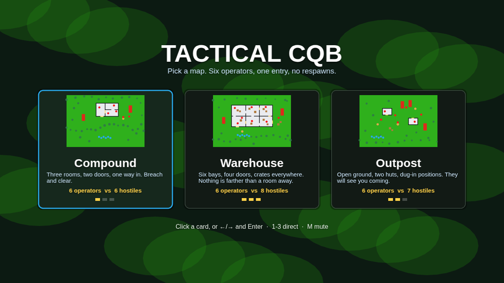
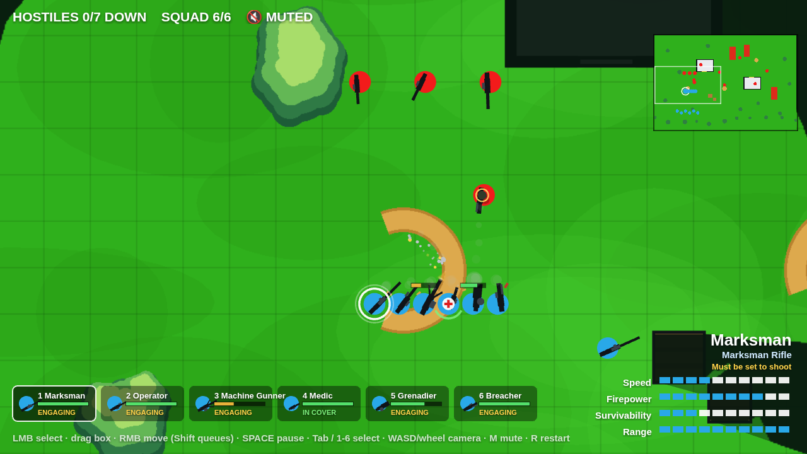
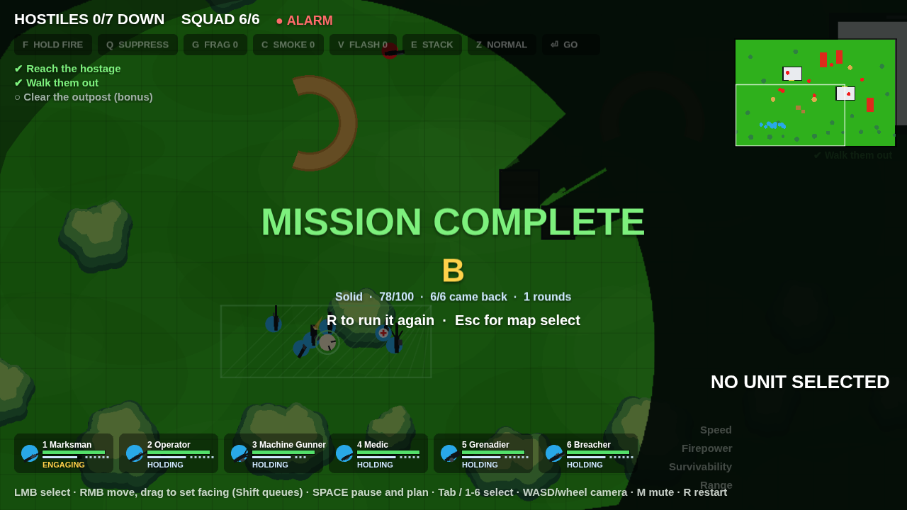

# Tactical CQB — top-down squad prototype

A browser game about clearing a building with a six-man squad: pick a map, click
to select, right-click to move, and watch line of sight peel the fog off the map
one room at a time. Pausable real-time — hit `Space`, plan, unpause, watch it play
out.

Built with Phaser 3 and Howler. No build step and no bundler — `npm install` is
only needed to run the tests.








## Running it

The game is plain static files, but it uses ES modules, so it needs to be served
over HTTP (opening `index.html` from the filesystem will not work):

```bash
python3 -m http.server 8000
# or: npx http-server -p 8000
```

Then open <http://localhost:8000>. It also works as-is on GitHub Pages or any
static host.

Phaser and Howler are loaded from a CDN with vendored copies in `vendor/` as an
automatic offline fallback, so the game still boots without a network.

## Controls

| Input | Action |
| --- | --- |
| Left click | Select a unit |
| Left drag | Box-select several units |
| Right click | Move order (units spread into a loose formation) |
| Right **drag** | Move, and face the way you dragged when you arrive |
| Shift + right click | Queue another waypoint |
| `Space` | Pause / unpause — orders can still be issued while paused |
| `F` | Hold fire / weapons free |
| `Q` then click | Suppress that patch of ground — no target needed |
| `G` then click | Throw a frag exactly there |
| `C` then click | Smoke: blocks sight, not bullets |
| `V` then click | Flashbang: blinds everyone who can see it |
| `E` then click a door | Stack beside it and wait |
| `Enter` | GO — everyone stacked goes through together |
| `Z` | Pace: normal → sprint (fast, no shooting) → careful (slow, stays set) |
| `Tab` | Cycle through the squad |
| `1`–`6` | Select a specific unit (hold Shift to add) |
| `Ctrl`+`A` | Select the whole squad |
| `Esc` | Clear selection — or, once the mission ends, back to map select |
| `W A S D` / arrows | Pan the camera |
| Middle-drag / wheel | Pan / zoom |
| `M` | Mute / unmute |
| `R` | Restart the current map |

## Maps

The game opens on a map select. Each card's thumbnail is drawn from that map's
own data, so it always matches what you are about to play.

Under the cards is one switch: **Ammo & reloads** (`T`, or click it). On, every
weapon has a magazine, a finite pouch of spares and real reload downtime — the
machine gunner's hundred-round belt costs four seconds to change, a hostile
reloading is a window to move, and suppressive fire stops being free. Off,
weapons never run dry, which is how the game played before the switch existed.
The choice is remembered in `localStorage`.

| Map | Plays like |
| --- | --- |
| **Compound** | Three rooms, two doors, one way in. The starter: breach and clear. |
| **Warehouse** | Six bays, four doors, crates everywhere. Nothing is farther than a room away — Breacher and Machine Gunner territory. |
| **Outpost** | Open ground, two huts, dug-in positions and patrols. Long sightlines; the Marksman earns its keep. |

`R` restarts the current map, `Esc` on the end-of-mission overlay goes back to the
map select. Maps live in `src/maps/`; adding one means adding a data module and a
row in `src/maps/index.js` — nothing else knows how many maps there are.

## What is in the mission

- **Six unit types, one of each deployed.** Every class carries a mechanic of its
  own, not just a different rifle:

  | Class | Plays like |
  | --- | --- |
  | **Operator** | Carbine, long reach, balanced — the baseline |
  | **Breacher** | Shotgun, close-range punch, tough, forces doors twice as fast — and carries the breaching charges and flashbangs |
  | **Grenadier** | Frags that arc over cover and detonate for area damage, plus smoke; won't throw when a squadmate is in the blast |
  | **Medic** | Heals nearby squadmates, and revives downed ones before they bleed out |
  | **Marksman** | Very long range and heavy single shots, but must be stationary to fire — and its rifle is **suppressed**, so it is the one weapon that does not raise the alarm |
  | **Machine Gunner** | Wide, fast, sustained fire that pins hostiles so they stop shooting back |

  The bottom-right card shows the selected unit's Speed / Firepower /
  Survivability / Range, read straight off the same stat table the simulation
  uses, plus its ability line and a pip per item of kit still in the pouch.
- **You can read your whole squad at once.** The bar along the bottom shows all
  six — health, rounds in the magazine and spares left, hotkey, and what each one
  is doing (HOLDING, ENGAGING, IN COVER, PINNED, RELOADING, BLINDED, SUPPRESSING,
  STACKED, WEAPONS TIGHT, DRY, DOWN with its bleed-out clock, KIA). Click a slot to select
  that operator. Top right is a minimap with the camera's viewport, your squad,
  and hostiles *someone can currently see*; click it to look somewhere. Under it
  runs a short event feed — kills, casualties, doors going in — and a unit that
  takes a round shows a red arc pointing back the way it came.
- **Cover is worth using.** Sandbags, crates and wrecks already stopped bullets;
  now a unit settled behind one is measurably harder to hit — incoming fire gets
  a spread penalty scaled by how well covered it is. Nobody repositions on their
  own: cover is something you get by putting people in the right place, and the
  roster tells you when it worked.
- **Casualties are recoverable.** A squadmate at zero HP goes *down* rather than
  dying: the ring around them counts off their bleed-out. Get the Medic there in
  time and they're back on their feet; don't, and they're gone for good.
- **Click-to-move with pathfinding.** A* over a walkability grid, then a
  string-pull pass so units walk clean diagonals instead of staircases. Units
  slide along walls rather than sticking to them.
- **Heading.** Every unit's rifle points where it is looking: along its path when
  moving, at its target when engaging.
- **Fog of war and line of sight.** A visibility polygon is raycast per unit
  against wall corners, so walls and shut doors throw real shadows. Ground the
  squad has already cleared stays dimly remembered; ground it has never seen
  stays dark. Hostiles are only drawn while somebody can actually see them, and
  they leave a faint "last known position" ghost when contact is lost.
- **Doors.** Doors start shut and block sight and movement. Walk a
  unit into one and it breaches it open, flooding the room with light — and
  usually with a firefight.
- **Hostiles.** Six to eight of them depending on the map, in three flavours:
  regulars holding arcs and patrol routes, a **Shotgunner** that rushes whoever it hears instead of holding
  ground, and a **Heavy** — slow, tough, long reach — covering the yard. Each
  runs PATROL/IDLE → ALERT → ENGAGE → SEARCH → FALLING-BACK, using the *same*
  line-of-sight test the player's fog uses, so if you cannot see them, they cannot
  see you. They also behave like a garrison rather than a set of strangers:
  - the first one to spot you **calls it out**, and everyone in earshot comes looking;
  - hostiles that are not the closest **work around your flank** instead of queueing up in the same doorway;
  - badly hurt ones **break contact** and stop shooting while they run;
  - a **body on the floor** is its own alarm to whoever finds it.

  Gunfire within earshot still pulls them off post, and enough incoming fire pins
  them in place.
- **Combat.** Fire is automatic on anything visible and in range. Bullets are
  simulated tracers that stop on walls, wrecks and sandbags. At zero HP a unit
  drops its weapon — the same silhouette it was carrying — and is marked with a
  black X.
- **Weapons you can read at a glance.** Each weapon is built from parts in
  `src/render/weapons.js`: barrel, receiver, stock and furniture, plus a drum on
  the launcher, a scope on the marksman rifle and splayed bipod legs on the
  machine gun. Firing kicks the gun back on its own axis, throws a muzzle flash
  shaped to the weapon — a wide bloom for buckshot, a long lance for the marksman
  — ejects brass, and leaves a wisp of smoke. Rounds strike walls in dust and
  sparks; grenades trail smoke and burst into a shockwave ring and debris.
- **Orders, not just move.** Firing is still automatic, but you can override it:
  hold fire to move without starting a fight, put suppressive fire on a doorway
  so nobody in it dares lean out, place a frag by hand instead of waiting for the
  grenadier to decide, drag a move order to say which way to face on arrival, and
  stack a team beside a door so they go through together on your word. Pace is a
  choice too — sprinting is fast with the weapon down, creeping is slow but keeps
  the marksman set. `src/systems/orders.js` owns all of it; every unit carries one
  order record, and an untouched record behaves exactly as the game did before.
- **Tools that change the ground, not just the damage.** Smoke is the important
  one: `src/systems/vision.js` keeps two occluder sets, and the game asks two
  different questions of them. `hasLineOfSight` is the bullet's question — walls,
  shut doors, crates — and blast and tracers use it. `canObserve` is the eye's
  question and adds whatever smoke is hanging in between; acquisition, the
  hostile brain and the fog all use that one. So you can cross open ground behind
  a cloud, fire blind through it, and be fired at blind through it, and none of
  that needed a special case. Flashbangs blind everyone with a view of the burst
  and hurt nobody, which is what makes a room enterable without a grenade.
  Breaching charges are the loud alternative to forcing a door by hand — a
  stacked breacher told to GO blows it and catches whoever was behind it.
- **An alarm worth avoiding.** The garrison has one state of mind for the whole
  map: **undetected**, **searching**, or **alarm**. A hostile with eyes on you,
  a body somebody has found, or an unsuppressed shot inside earshot each take it
  straight to alarm — and then patrol routes are abandoned, everyone converges on
  your last known position, and a single wave of reinforcements walks in from the
  map's entry roads. One wave, once: the point is pressure on a mission that has
  gone loud, not a faucet that makes it unwinnable. The marksman's rifle is
  suppressed, so its shots carry a third as far and never raise the alarm by
  themselves — though the body will, once somebody finds it. `src/systems/alarm.js`
  reads world state rather than being told about events, so there is no
  bookkeeping to drift out of sync.
- **Missions, not just maps.** Each map states what it is for, and only one of
  the three is "kill everyone". Compound is a straight clear. Warehouse is an
  intel run: reach the office, take what you came for, and get the whole squad
  back to the extraction zone — killing the garrison is a bonus, not the job.
  Outpost is a rescue: somebody is being held in the east hut, they follow you
  once you reach them, and **if they die the mission is lost** — which is what
  makes a frag through the door the wrong answer and a flashbang the right one.
  An exfil always waits on every other objective, so it is never a way to skip
  the mission.
- **A grade at the end.** Missions are standalone, so the only reason to run one
  twice is to run it better: the outcome screen scores time, casualties, whether
  the alarm ever went up and whether you took the bonus, and hands out S through
  D. Winning and winning well are different things.
- **Pausable real-time.** `Space` freezes the simulation but not the interface:
  select units, issue orders, and see them drawn as dashed plans, then unpause.
  With orders in the game the pause is a planning phase rather than a freeze
  frame — the whole squad can be given its part of a plan before anyone moves.
- **Sound.** Every weapon has its own report, and there are effects for grenades
  and their detonation, rounds striking walls and bodies, a door going in, a
  squadmate going down or being revived, and the mission ending. Playback is
  Howler over a single sprite; the bank itself is rendered ahead of time by
  `tools/build-audio.mjs`, which layers noise and oscillators through filters,
  saturation and a small reverb, and bakes **three takes of each weapon** so a
  burst never sounds like one sample on repeat. The camera is the ear — sounds
  fall off with distance from the middle of the view and pan to the side they
  happened on. `M` mutes.

  Regenerate the bank after editing the recipes:

  ```bash
  node tools/build-audio.mjs   # writes assets/audio/sfx.wav + src/audio-sprite.js
  ```

## Tests

```bash
npm install     # devDependencies only — the game itself still has none
npm test
```

- `test/maps.test.mjs` and `test/audio.test.mjs` run in plain Node, no browser:
  every spawn standable, every hostile and door reachable by A*, patrol routes
  valid, fresh door state per build, and every weapon sound resolving to a real
  entry in the generated bank. The map suite has already caught a hostile spawned
  inside a crate and a patrol waypoint inside a wreck.
- `test/tactics.test.mjs` also runs in plain Node: it builds a headless world
  with the same systems in the same update order as `GameScene` and asserts the
  tactical rules directly — a unit on hold fires nothing, ordered suppression
  pins whoever is standing in it, a sprinter does not shoot, a careful marksman
  stays set while moving, a stacked unit waits for the word before the door goes
  in, an aimed throw spends exactly one grenade, smoke blocks the view but not
  the bullet, a flashbang blinds only what could see it, a magazine runs out and
  costs real time to change, an unsuppressed shot raises the alarm and a
  suppressed one does not, exactly one reinforcement wave arrives, and a mission
  ends on its objectives rather than on a body count.
- `test/smoke.test.mjs` drives the real game in Chromium via Playwright: menu →
  mission → win → back to the menu, with a clean console. It is skipped with a
  notice if Playwright is not installed. On a machine with a global install,
  point the runner at it: `PLAYWRIGHT_PATH=/path/to/playwright/index.js npm test`.
- CI runs the whole suite on every push (`.github/workflows/ci.yml`).

## Layout

```
index.html              page shell, CDN tags + offline fallbacks
vendor/                 vendored Phaser and Howler for offline play
assets/audio/sfx.wav    generated sound bank (see tools/build-audio.mjs)
tools/build-audio.mjs   offline sound renderer
src/main.js             Phaser boot
src/config.js           tuning: stats, weapons, colours, fog, AI timings
src/level.js            shared geometry helpers (what blocks movement/sight)
src/maps/               compound, warehouse, outpost + the map registry
src/audio-sprite.js     generated sprite offsets
src/scenes/MenuScene.js map select
src/scenes/GameScene.js per-frame orchestration, orders, pause, outcome
src/systems/nav.js      walk grid, A*, path smoothing
src/systems/vision.js   line of sight, visibility polygons, fog layers
src/systems/units.js    unit state, movement, breaching, damage, downed
src/systems/combat.js   weapons, tracers, grenades, suppression
src/systems/support.js  medic healing and revives
src/systems/cover.js    how well a unit is shielded from a given threat
src/systems/audio.js    procedural sound: synth engine and the sound table
src/systems/ai.js       hostile state machine
src/systems/input.js    selection, orders, camera
src/systems/effects.js  particles: brass, smoke, sparks, debris, shockwaves
src/render/terrain.js   baked scenery: grass, grid, trees, building, props
src/render/weapons.js   weapon part shapes, muzzle flashes, recoil placement
src/render/entities.js  units, corpses, doors, tracers, order lines
src/render/preview.js   map thumbnails drawn from map data
src/render/roster.js    the squad bar
src/render/minimap.js   minimap with camera rect and live markers
src/render/hud.js       unit card, mission status, event feed, overlays
test/                   map, audio and browser smoke suites + runner
```

Two knobs worth knowing about: `src/config.js` holds every gameplay number in one
place, and `?renderer=canvas` forces Phaser's canvas backend (the fog has a
separate code path there, since inverted geometry masks are WebGL-only).
