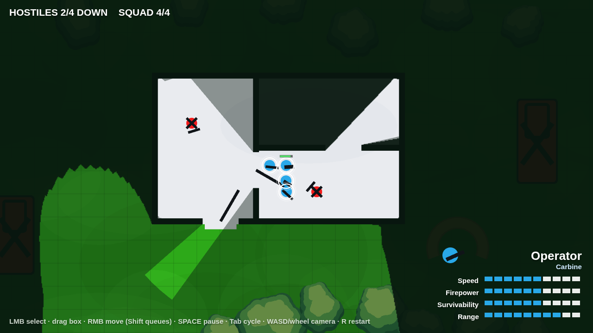
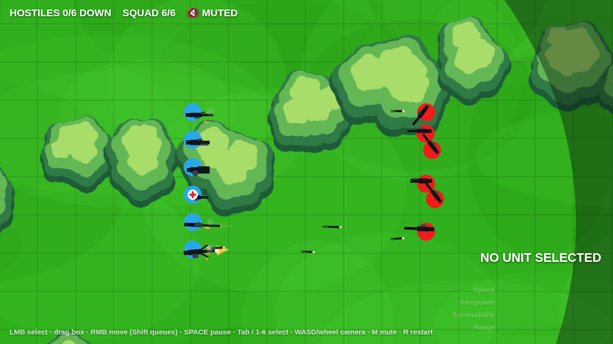

# Tactical CQB — top-down squad prototype

A browser game about clearing a building with a six-man squad: click to select,
right-click to move, and watch line of sight peel the fog off the map one room at
a time. Pausable real-time — hit `Space`, plan, unpause, watch it play out.

Built with Phaser 3. No build step, no bundler, no npm install.





## Running it

The game is plain static files, but it uses ES modules, so it needs to be served
over HTTP (opening `index.html` from the filesystem will not work):

```bash
python3 -m http.server 8000
# or: npx http-server -p 8000
```

Then open <http://localhost:8000>. It also works as-is on GitHub Pages or any
static host.

Phaser is loaded from a CDN with a vendored copy in `vendor/phaser.min.js` as an
automatic offline fallback, so the game still boots without a network.

## Controls

| Input | Action |
| --- | --- |
| Left click | Select a unit |
| Left drag | Box-select several units |
| Right click | Move order (units spread into a loose formation) |
| Shift + right click | Queue another waypoint |
| `Space` | Pause / unpause — orders can still be issued while paused |
| `Tab` | Cycle through the squad |
| `1`–`6` | Select a specific unit (hold Shift to add) |
| `Ctrl`+`A` | Select the whole squad |
| `Esc` | Clear selection |
| `W A S D` / arrows | Pan the camera |
| Middle-drag / wheel | Pan / zoom |
| `M` | Mute / unmute |
| `R` | Restart the mission |

## What is in the mission

- **Six unit types, one of each deployed.** Every class carries a mechanic of its
  own, not just a different rifle:

  | Class | Plays like |
  | --- | --- |
  | **Operator** | Carbine, long reach, balanced — the baseline |
  | **Breacher** | Shotgun, close-range punch, tough, forces doors twice as fast |
  | **Grenadier** | Four grenades that arc over cover and detonate for area damage; won't throw when a squadmate is in the blast |
  | **Medic** | Heals nearby squadmates, and revives downed ones before they bleed out |
  | **Marksman** | Very long range and heavy single shots, but must be stationary to fire |
  | **Machine Gunner** | Wide, fast, sustained fire that pins hostiles so they stop shooting back |

  The bottom-right card shows the selected unit's Speed / Firepower /
  Survivability / Range, read straight off the same stat table the simulation
  uses, plus its ability line and remaining grenades.
- **Casualties are recoverable.** A squadmate at zero HP goes *down* rather than
  dying: the ring around them counts off their bleed-out. Get the Medic there in
  time and they're back on their feet; don't, and they're gone for good.
- **Click-to-move with pathfinding.** A* over a walkability grid, then a
  string-pull pass so units walk clean diagonals instead of staircases. Units
  slide along walls rather than sticking to them.
- **Heading.** Every unit's rifle points where it is looking: along its path when
  moving, at its target when engaging.
- **Fog of war and line of sight.** A visibility polygon is raycast per unit
  against wall corners, so walls and shut doors throw real shadows. Ground the
  squad has already cleared stays dimly remembered; ground it has never seen
  stays dark. Hostiles are only drawn while somebody can actually see them, and
  they leave a faint "last known position" ghost when contact is lost.
- **Doors.** Both interior doors start shut and block sight and movement. Walk a
  unit into one and it breaches it open, flooding the room with light — and
  usually with a firefight.
- **Hostiles.** Six of them in three flavours: regulars holding arcs and patrol
  routes, a **Shotgunner** that rushes whoever it hears instead of holding
  ground, and a **Heavy** — slow, tough, long reach — covering the yard. Each
  runs PATROL/IDLE → ALERT → ENGAGE → SEARCH, using the *same* line-of-sight test
  the player's fog uses, so if you cannot see them, they cannot see you. Gunfire
  within earshot pulls them off their post to investigate, and enough incoming
  fire pins them in place.
- **Combat.** Fire is automatic on anything visible and in range. Bullets are
  simulated tracers that stop on walls, wrecks and sandbags. At zero HP a unit
  drops its weapon — the same silhouette it was carrying — and is marked with a
  black X.
- **Weapons you can read at a glance.** Each weapon is built from parts in
  `src/render/weapons.js`: barrel, receiver, stock and furniture, plus a drum on
  the launcher, a scope on the marksman rifle and splayed bipod legs on the
  machine gun. Firing kicks the gun back on its own axis, throws a muzzle flash
  shaped to the weapon — a wide bloom for buckshot, a long lance for the marksman
  — ejects brass, and leaves a wisp of smoke. Rounds strike walls in dust and
  sparks; grenades trail smoke and burst into a shockwave ring and debris.
- **Pausable real-time.** `Space` freezes the simulation but not the interface:
  select units, issue orders, and see them drawn as dashed plans, then unpause.
- **Sound, synthesised on the fly.** Each weapon has its own report, and there are
  effects for grenades and their detonation, rounds striking walls and bodies, a
  door going in, a squadmate going down or being revived, and the mission ending.
  Nothing is loaded from disk: every sound is built from filtered noise and swept
  oscillators through the Web Audio API, so there are no audio files to ship. The
  camera is the ear — sounds fall off with distance from the middle of the view
  and pan to the side they happened on. `M` mutes.

## Layout

```
index.html              page shell, Phaser CDN tag + offline fallback
vendor/phaser.min.js    vendored engine for offline play
src/main.js             Phaser boot
src/config.js           tuning: stats, weapons, colours, fog, AI timings
src/level.js            the map: walls, doors, props, trees, spawns, patrols
src/scenes/GameScene.js per-frame orchestration, orders, pause, outcome
src/systems/nav.js      walk grid, A*, path smoothing
src/systems/vision.js   line of sight, visibility polygons, fog layers
src/systems/units.js    unit state, movement, breaching, damage, downed
src/systems/combat.js   weapons, tracers, grenades, suppression
src/systems/support.js  medic healing and revives
src/systems/audio.js    procedural sound: synth engine and the sound table
src/systems/ai.js       hostile state machine
src/systems/input.js    selection, orders, camera
src/systems/effects.js  particles: brass, smoke, sparks, debris, shockwaves
src/render/terrain.js   baked scenery: grass, grid, trees, building, props
src/render/weapons.js   weapon part shapes, muzzle flashes, recoil placement
src/render/entities.js  units, corpses, doors, tracers, order lines
src/render/hud.js       unit card, mission status, pause and outcome overlays
```

Two knobs worth knowing about: `src/config.js` holds every gameplay number in one
place, and `?renderer=canvas` forces Phaser's canvas backend (the fog has a
separate code path there, since inverted geometry masks are WebGL-only).
